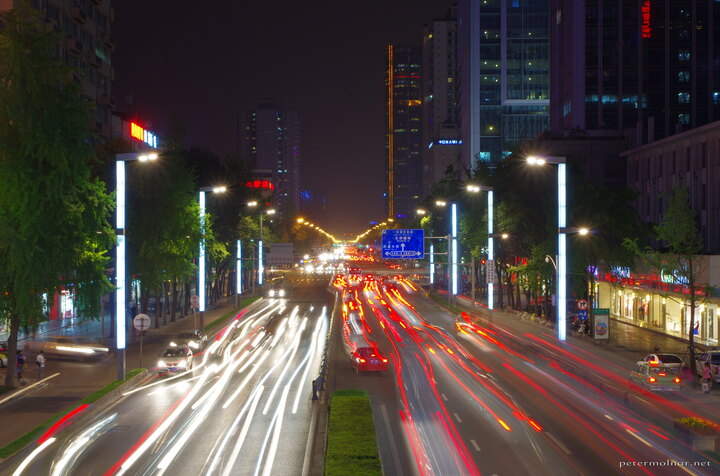

---
author:
    email: mail@petermolnar.net
    image: https://petermolnar.net/favicon.jpg
    name: Peter Molnar
    url: https://petermolnar.net
coordinates:
    latitude: 30.649579
    longitude: 104.080181
copies:
- https://www.flickr.com/photos/36003160@N08/26795117066
- http://web.archive.org/web/20160709134701/https://petermolnar.eu/chengdu-night-lights/
published: '2016-04-30T10:00:36+00:00'
syndicate:
- https://brid.gy/publish/flickr
tags:
- traffic
- People's Republic of China
- Chengdu
- Sichuan
- cityscape
- nightscape
- lights
- city
- cars
- China
- night
title: Chengdu Night Lights

---

Unlike the nightscapes in Europe, nightscapes in China is hard. There
will be no straight white and red lines of car lights in Chendgu :)