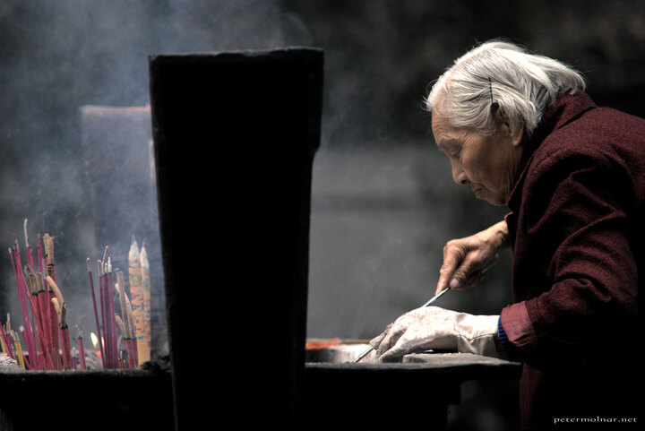

---
author:
    email: mail@petermolnar.net
    image: https://petermolnar.net/favicon.jpg
    name: Peter Molnar
    url: https://petermolnar.net
coordinates:
    latitude: 30.663866
    longitude: 104.040162
copies:
- https://www.flickr.com/photos/36003160@N08/15270140893
- http://web.archive.org/web/20141207160824/https://petermolnar.eu/photo/chengdu-shrine-keeper/
published: '2014-10-24T05:57:18+00:00'
syndicate:
- https://brid.gy/publish/flickr
tags:
- Chengdu
- Sichuan
- Qingyang Taoist Temple
- incense
- China
- taoism
- shrine
title: Shrinekeeper in Qingyang Taoist Temple

---

The Qingyang Taoist Temple in Chengdu (成都) is rather a small, ancient
village than a temple, from the eyes of a European. This old lady was
keeping the incense holder clean and tidy in front of a shrine.