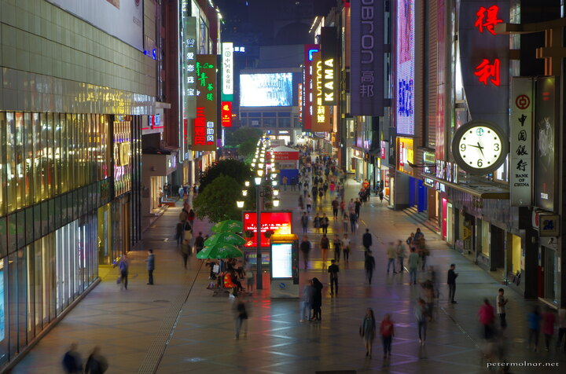

---
author:
    email: mail@petermolnar.net
    image: https://petermolnar.net/favicon.jpg
    name: Peter Molnar
    url: https://petermolnar.net
coordinates:
    latitude: 30.655408
    longitude: 104.05714
copies:
- https://www.flickr.com/photos/36003160@N08/26224376884
- http://web.archive.org/web/20160709134706/https://petermolnar.eu/chunxi-road/
published: '2016-05-01T10:00:39+00:00'
syndicate:
- https://brid.gy/publish/flickr
tags:
- People's Republic of China
- Chengdu
- Sichuan
- nightlife
- street
- shopping
- urban
- China
- night
- metropolis
title: Chunxi Road

---

In Chengdu, most of the things, especially the shopping oriented areas,
are open till 22:00, so late night shopping is by default a thing. I
believe there is at least one street like this in every major city in
the world, but unlike the usual, there were much more local brands
present here.