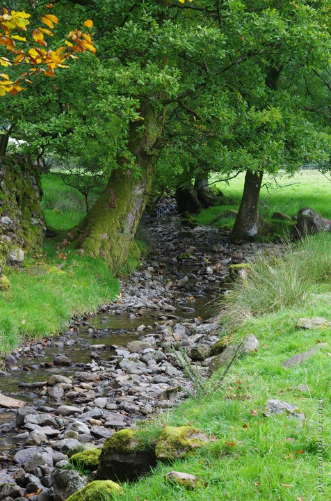

---
author:
    email: mail@petermolnar.net
    image: https://petermolnar.net/favicon.jpg
    name: Peter Molnar
    url: https://petermolnar.net
coordinates:
    latitude: 54.455638
    longitude: -3.029555
copies:
- https://www.flickr.com/photos/36003160@N08/22034771448
- http://web.archive.org/web/20190624125316/https://petermolnar.net/come-to-england-we-have-fairyland/
published: '2015-10-16T15:59:51+00:00'
syndicate:
- https://brid.gy/publish/flickr
tags:
- green
- autumn
- countryside
- fairy
- fairyland
- Lake District
- Grasmere
title: Come to England. We have fairyland.

---

In case you've ever wondered what could have been the inspiration behind
fairytales; all the stories filled with pixies, sprites, the small
people; you probably haven't been to the English or the Irish
countryside yet.