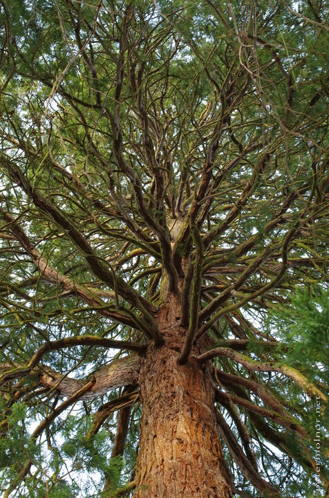

---
author:
    email: mail@petermolnar.net
    image: https://petermolnar.net/favicon.jpg
    name: Peter Molnar
    url: https://petermolnar.net
copies:
- https://www.flickr.com/photos/36003160@N08/24592394801
- http://web.archive.org/web/20160709134714/https://petermolnar.eu/crown/
published: '2016-01-29T10:51:00+00:00'
syndicate:
- https://brid.gy/publish/flickr
tags:
- branches
- branch
- tree
- sky
- winter
title: Crown

---

I'd been trying to take pictures like this for years, barely ever
resulting in anything usable or even remotely similar to what I actually
saw. This is one of the exceptions, and ancient red tree in the garden
of Anglesey Abbey.