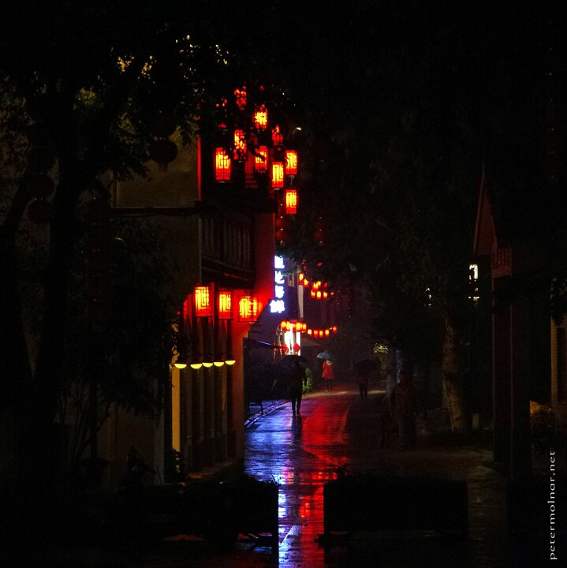

---
author:
    email: mail@petermolnar.net
    image: https://petermolnar.net/favicon.jpg
    name: Peter Molnar
    url: https://petermolnar.net
copies:
- http://web.archive.org/web/20210424092612/https://petermolnar.net/photo/dadou-road/
- https://www.flickr.com/photos/36003160@N08/51136974777
published: '2021-04-25T09:00:00+01:00'
title: Dadou Road

---

It's strange which pictures and scenes stay with you. Close to the end
of our journes in China in 2019 we were back in Hangzhou, only to learn
that it was basically impossible to get into restaurants late in the
evening - read: after 20:00. We ended up going to the food market of the
closest mall, because that was open till 22:00. On our way back, after a
rather rainy day, the streets were mostly empty, including this normally
busy with people and tourists street.
