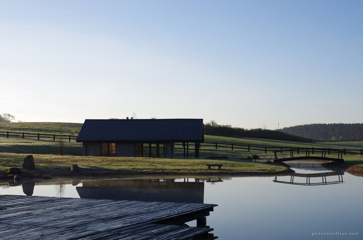

---
author:
    email: mail@petermolnar.net
    image: https://petermolnar.net/favicon.jpg
    name: Peter Molnar
    url: https://petermolnar.net
copies:
- https://www.flickr.com/photos/36003160@N08/27776774868
- http://web.archive.org/web/20180503152403/https://petermolnar.net/dawn-at-dojo-stara-wies/
published: '2018-04-23T18:00:00+00:00'
syndicate:
- https://brid.gy/publish/flickr
tags:
- Poland
- Japanese
- Dojo Stara Wieś
title: Dawn at Dojo Stara Wieś

---

I had the chance from Pakua UK[^1] to spend a weekend at Dojo Stara
Wieś[^2] in Poland. Unexpected as it is, the Dojo is a small village,
built for Japanese martial arts, in Japanese architectural style.

While it's not the complete fairytale Japan one might expect, in the
end, the only thing one could wish for is a small forest of giant
bamboo, because everything else is tranquility here. The ponds were full
of huge frogs and lovely newts, the air was filled with loud and happy
birds - it's a lovely place.

I took the picture not that early, sometimes just after sunrise.

[^1]: <https://www.pakuauk.com/>

[^2]: <http://www.dojostarawies.com/en.html>