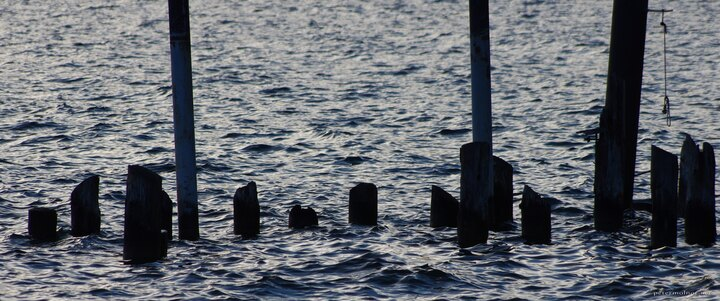

---
author:
    email: mail@petermolnar.net
    image: https://petermolnar.net/favicon.jpg
    name: Peter Molnar
    url: https://petermolnar.net
copies:
- https://www.flickr.com/photos/36003160@N08/21597862508
- http://web.archive.org/web/20190624125325/https://petermolnar.net/dead-pier/
published: '2015-09-28T14:06:00+00:00'
syndicate:
- https://brid.gy/publish/flickr
tags:
- posts
- abandoned
- pier
- sunset
- derelict
- water
- reflection
title: Dead pier

---

Cankerous posts of an old pier in the lake Traumsee in Gmunden. While
the other direction is filled with glamorous, pink-coloured, sunset
mountains, sometimes there are other bits and pieces around that can be
interesting.