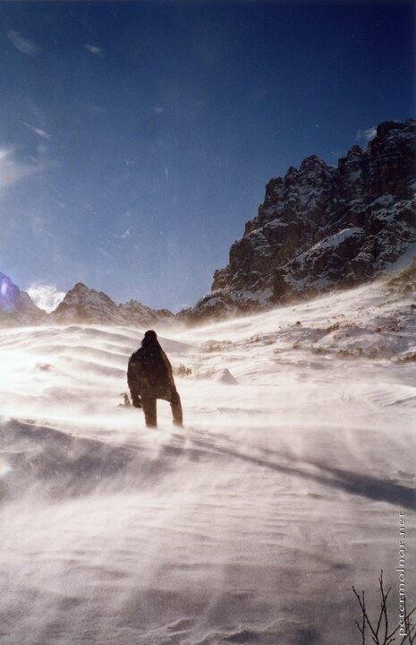

---
author:
    email: mail@petermolnar.net
    image: https://petermolnar.net/favicon.jpg
    name: Peter Molnar
    url: https://petermolnar.net
copies:
- http://web.archive.org/web/20200923080355/https://petermolnar.net/photo/deakahegyen/
published: '2003-03-01T09:00:00+02:00'
tags:
- silhouetta
- mountains
- winter
title: Deák a hegyen

---

I believe this image was taken at the beginning of 2003 (and, given the
time, this was analog film; a rather cheap one as well, sadly). We
arrived at our sky camp, in Italy earlier, than expected, in a beautiful
weather. Given this was with my high school, we had our PE teachers with
us; one of them asked if we were up for a "walk". Only a few decided to
go, which was fortunate: while you stayed on the path, it was fine, but
if you happened to take a step away, you immediately found yourself
waist deep in snow. It's annoyingly troublesome to get out of waist deep
snow, did you know that?

The image was taken at the point when we decided to turn back, before
the sun sets on us.