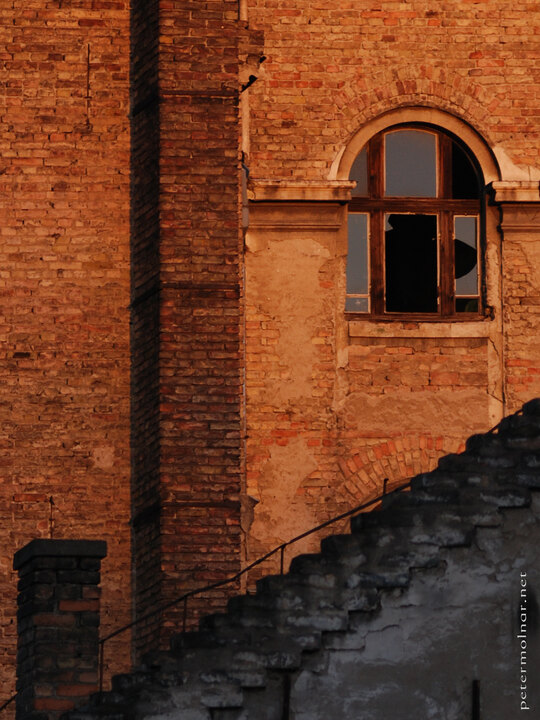

---
author:
    email: mail@petermolnar.net
    image: https://petermolnar.net/favicon.jpg
    name: Peter Molnar
    url: https://petermolnar.net
copies:
- http://web.archive.org/web/20200923080357/https://petermolnar.net/photo/derelict-window/
published: '2011-03-07T17:19:44+01:00'
tags:
- Budapest
- derelict
- window
- ruin
- wall
title: Derelict window

---

An abandoned building's window in Budapest. This was part of my regular
views from Kandó, when I worked there, so it wasn't a problem to wait
for ideal light.