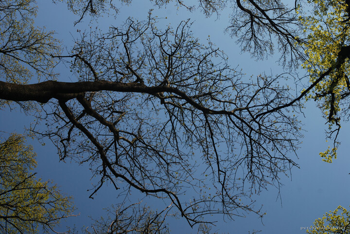

---
author:
    email: mail@petermolnar.net
    image: https://petermolnar.net/favicon.jpg
    name: Peter Molnar
    url: https://petermolnar.net
copies:
- https://www.flickr.com/photos/36003160@N08/18190013748
- http://web.archive.org/web/20160709134730/https://petermolnar.eu/disrupted-sky/
published: '2015-06-02T09:16:06+00:00'
syndicate:
- https://brid.gy/publish/flickr
tags:
- blue
- outdoor
- forest
- branch
- afternoon
- sky
- tree
title: Disrupted sky

---

At a nice, April day we gathered some friends to go and visit a now
disfunctioning aluminium metallurgy, which, as far as we knew, was
turned into something like a museum.

We learned that indeed, it used to be a museum, for about a year, but
was sold ages ago before we tried to get in. So we ended up in a not too
far forest instead, just to make something out of the day. Lessons to
learn: don't trust articles older than a year.