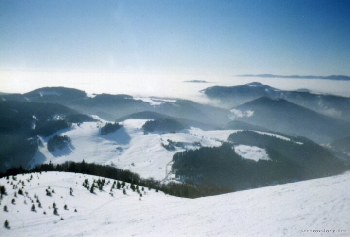

---
author:
    email: mail@petermolnar.net
    image: https://petermolnar.net/favicon.jpg
    name: Peter Molnar
    url: https://petermolnar.net
copies:
- http://web.archive.org/web/20200923080358/https://petermolnar.net/photo/donovaly/
published: '2002-06-26T19:40:00+02:00'
tags:
- skiing
- Slovakia
- mountains
- sea of clouds
title: Donovaly

---

During my elementary school, our go to ski "resort" was Donovaly. It's
small, it's cheap, but at least we knew it well. One morning, when I
turned around, I saw sea of clouds for hte first time in my life.
Unfortunately the camera with me wasn't half decent; neither was the
film - remember, this is before 2000 (if my memory serves well, 1998, to
be specific), but at least I have a picture of it.