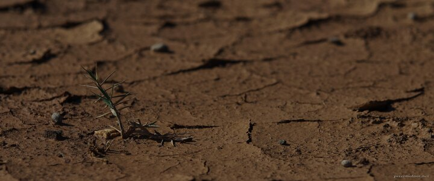

---
author:
    email: mail@petermolnar.net
    image: https://petermolnar.net/favicon.jpg
    name: Peter Molnar
    url: https://petermolnar.net
copies:
- http://web.archive.org/web/20190624125345/https://petermolnar.net/drought/
- https://flickr.com/photos/petermolnareu/39714743583
published: '2019-01-08T18:00:00+00:00'
syndicate:
- https://brid.gy/publish/flickr
title: Drought

---

Spikes, dry dirt, heat - although it's a bit of an illusion. This was
next to a stream, on an area which only gets wet during spring, but it
was right next to fresh water.
