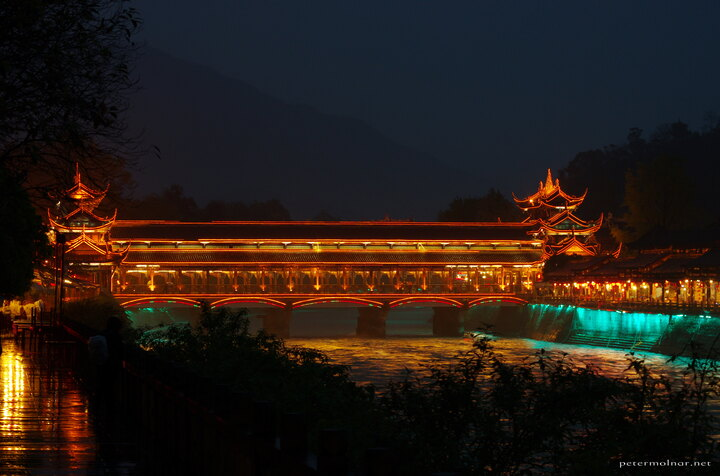

---
author:
    email: mail@petermolnar.net
    image: https://petermolnar.net/favicon.jpg
    name: Peter Molnar
    url: https://petermolnar.net
coordinates:
    latitude: 30.998634
    longitude: 103.615432
copies:
- https://www.flickr.com/photos/36003160@N08/26896261686
- http://web.archive.org/web/20160709134745/https://petermolnar.eu/dujiangyan-at-night-1/
published: '2016-05-10T10:00:26+00:00'
syndicate:
- https://brid.gy/publish/flickr
tags:
- Dujiangyan
- People's Republic of China
- water
- ancient
- night lights
- flow
- chinese
- lights
- China
- longexpo
- LED
- night
title: Dujiangyan at night 1

---

We weren't expecting this many lights in the city of Dujiangyan. It
still stuns me that unlike most cities in Europe, Chinese cities love
extensive night lights and since they are mostly LEDs, it's not even
expensive.