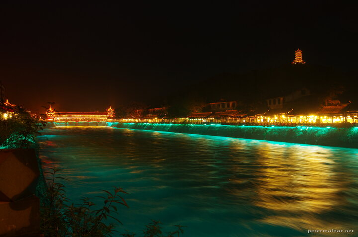

---
author:
    email: mail@petermolnar.net
    image: https://petermolnar.net/favicon.jpg
    name: Peter Molnar
    url: https://petermolnar.net
coordinates:
    latitude: 30.9980751000306
    longitude: 103.61707725
copies:
- https://www.flickr.com/photos/36003160@N08/41730892764
- http://web.archive.org/web/20190624125350/https://petermolnar.net/dujiangyan-at-night-3/
published: '2016-05-12T10:00:20+00:00'
syndicate:
- https://brid.gy/publish/flickr
tags:
- Dujiangyan
- People's Republic of China
- water
- ancient
- night lights
- flow
- chinese
- lights
- China
- longexpo
- LED
- night
title: Dujiangyan at night 3

---

We weren't expecting this many lights in the city of Dujiangyan. It
still stuns me that unlike most cities in Europe, Chinese cities love
extensive night lights and since they are mostly LEDs, it's not even
expensive.

I love that even the temple on the hill is bathing in light.