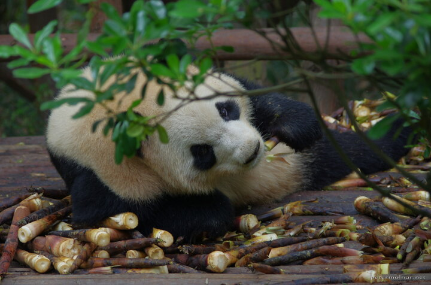

---
author:
    email: mail@petermolnar.net
    image: https://petermolnar.net/favicon.jpg
    name: Peter Molnar
    url: https://petermolnar.net
coordinates:
    latitude: 30.735712
    longitude: 104.146716
copies:
- https://www.flickr.com/photos/36003160@N08/26829869035
- http://web.archive.org/web/20160709134803/https://petermolnar.eu/eating-panda-1/
published: '2016-05-05T10:00:33+00:00'
syndicate:
- https://brid.gy/publish/flickr
tags:
- People's Republic of China
- Sichuan
- panda
- giant panda
- China
- Chendgu
title: None

---

This fellow was eating with it's back to the people, but soon, everyone
else except the two of us left for a few minutes. By that time, I
finally got to exchange looks and got a glimpse of it's face.