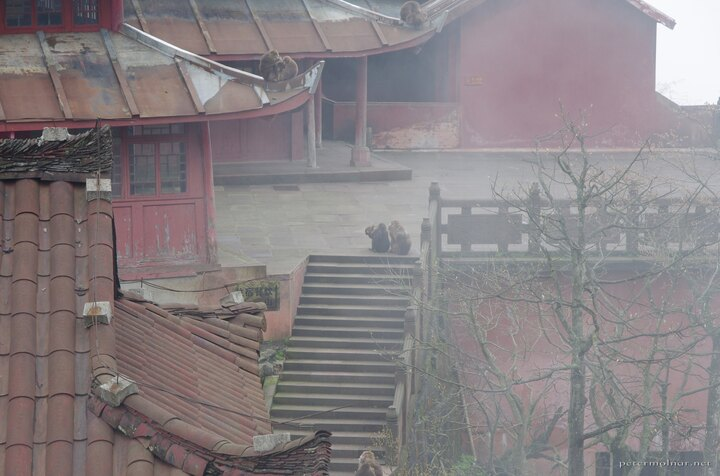

---
author:
    email: mail@petermolnar.net
    image: https://petermolnar.net/favicon.jpg
    name: Peter Molnar
    url: https://petermolnar.net
coordinates:
    latitude: 29.557161
    longitude: 103.343669
copies:
- https://www.flickr.com/photos/36003160@N08/28066229656
- http://web.archive.org/web/20160709135536/https://petermolnar.net/elephant-bathing-pool-xixiangchi-monastery/
published: '2016-07-05T08:00:04+00:00'
syndicate:
- https://brid.gy/publish/flickr
tags:
- Sichuan
- monkey
- Xixiangchi
- monastery
- peace
- Tibetan Macaque
- Mount Emei
- China
title: Elephant Bathing Pool - Xixiangchi Monastery

---

According to the legend, this was the spot where Samantabhadra stopped
his elephant to have a rest in a pool on his way to the mountain top -
thus the name.

Imagine an ancient monastery, with only a handful a people, up in the
clouds, with red walls and forgotten silence. Imagine monkeys slowly
taking over it, sitting all around on the irregular walls, next to slant
walls, playing, and waiting for people to come.

I never really thought places like this exist, but they do.