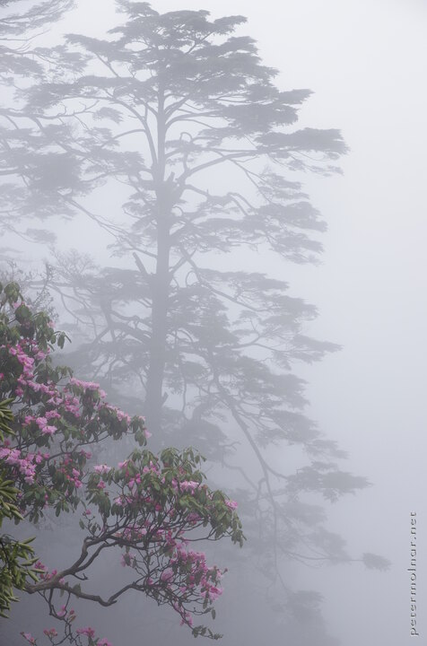

---
author:
    email: mail@petermolnar.net
    image: https://petermolnar.net/favicon.jpg
    name: Peter Molnar
    url: https://petermolnar.net
coordinates:
    latitude: 29.536314
    longitude: 103.334256
copies:
- https://www.flickr.com/photos/36003160@N08/27979930232
- http://web.archive.org/web/20190624125415/https://petermolnar.net/emei-flowers/
published: '2016-06-30T08:00:42+00:00'
syndicate:
- https://brid.gy/publish/flickr
tags:
- People's Republic of China
- Sichuan
- fog
- Mount Emei
- mist
- mountain
- Emeishan
- pine
- China
- cloud
title: Emei flowers

---

Arriving at the top of Emei, at 3099m wasn't as elevating as we expected
- mostly due to the thick fog. Given you're sitting inside a cloud, it
is reasonable, but takes away one of the most magnificent scenery you
could experience.

However, it certainly results in a mystical, film-like atmosphere, where
colours are unexpected and surprising.