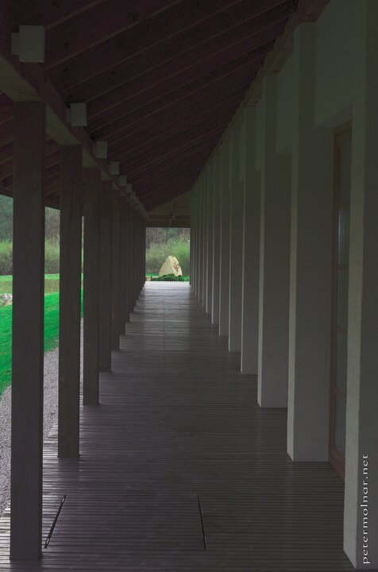

---
author:
    email: mail@petermolnar.net
    image: https://petermolnar.net/favicon.jpg
    name: Peter Molnar
    url: https://petermolnar.net
copies:
- https://www.flickr.com/photos/36003160@N08/39837737950
- http://web.archive.org/web/20190624125417/https://petermolnar.net/engawa-of-the-dojo-building-in-dojo-stara-wies/
published: '2018-04-24T18:00:00+00:00'
syndicate:
- https://brid.gy/publish/flickr
tags:
- Poland
- Japanese
- Dojo Stara Wies
title: Engawa of the dojo building at Dojo Stara Wieś

---

This is the ourdoor veranda, the engawa of the dojo building itself at
Dojo Stara Wieś[^1]. The building hosts three beautiful areas to
practice martial arts in a place, which resembles their origin quite
well.

[^1]: <http://www.dojostarawies.com/en.html>