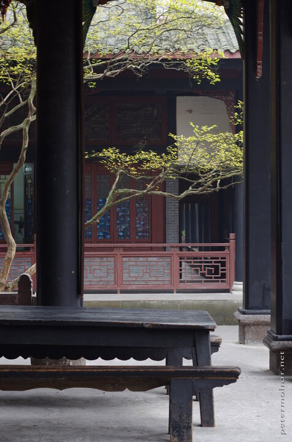

---
author:
    email: mail@petermolnar.net
    image: https://petermolnar.net/favicon.jpg
    name: Peter Molnar
    url: https://petermolnar.net
coordinates:
    latitude: 31.007971
    longitude: 103.607153
copies:
- https://www.flickr.com/photos/36003160@N08/26793989690
- http://web.archive.org/web/20190624125419/https://petermolnar.net/erwang-temple-garden/
published: '2016-05-17T09:00:21+00:00'
syndicate:
- https://brid.gy/publish/flickr
tags:
- Dujiangyan
- People's Republic of China
- Sichuan
- temple
- garden
- taoist
- China
- taoism
title: Erwang temple garden

---

Most of the monasteries and temples have areas where people can gather
and sit down - for tourists, this can be a bless.

We were at the very and of the day and only a few of us stayed this
long, so I could take a peaceful image of the place.