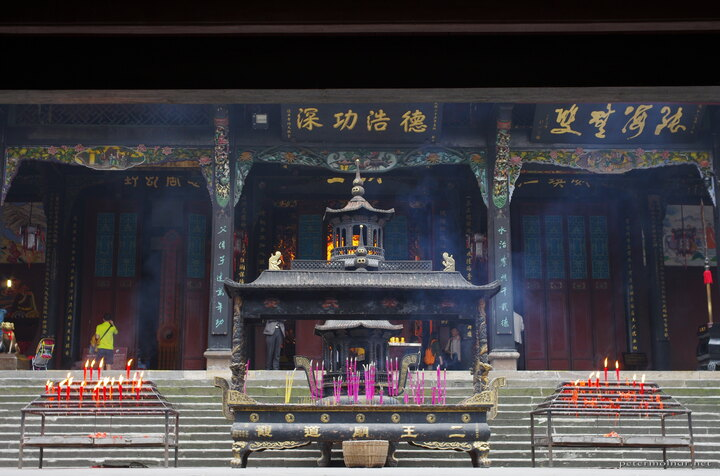

---
author:
    email: mail@petermolnar.net
    image: https://petermolnar.net/favicon.jpg
    name: Peter Molnar
    url: https://petermolnar.net
coordinates:
    latitude: 31.007971
    longitude: 103.607153
copies:
- https://www.flickr.com/photos/36003160@N08/26978269591
- http://web.archive.org/web/20190624125420/https://petermolnar.net/erwang-temple/
published: '2016-05-16T09:00:20+00:00'
syndicate:
- https://brid.gy/publish/flickr
tags:
- Dujiangyan
- People's Republic of China
- Sichuan
- temple
- taoist
- China
- taoism
title: Erwang Temple

---

Most of the places which are easy or relatively easy to reach are packed
with tourists on many days. It's really hard to make a picture where the
people don't disturb the scene too much.

As for the angles: I decided not to cut the image, because it's then
visible - check the ceiling - that there are barely any straight lines
in this temple :)