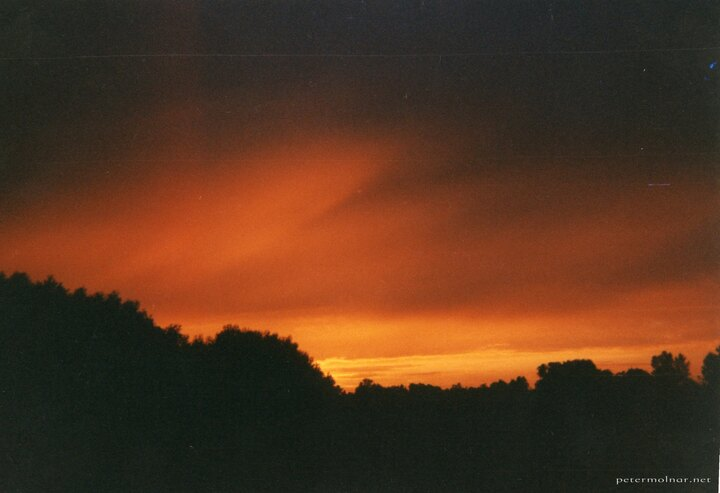

---
author:
    email: mail@petermolnar.net
    image: https://petermolnar.net/favicon.jpg
    name: Peter Molnar
    url: https://petermolnar.net
copies:
- http://web.archive.org/web/20200923080403/https://petermolnar.net/photo/este/
published: '2001-06-25T19:40:00+02:00'
tags:
- sunset
- silhouette
title: Este

---

I think this is the first image I ever took I was proud of. I vividly
remember the setting: I was sitting on top of the fence, waiting for the
sunset moment I wanted to capture for a while. I'm a bit unsure of the
year - I believe it was 1991, which makes me 6 years old when it was
taken. The camera was a fix-focus, 35mm film soap box; it didn't even
have automatic film forwarding, but it must have been able to do some
automatic shutter speed setting.