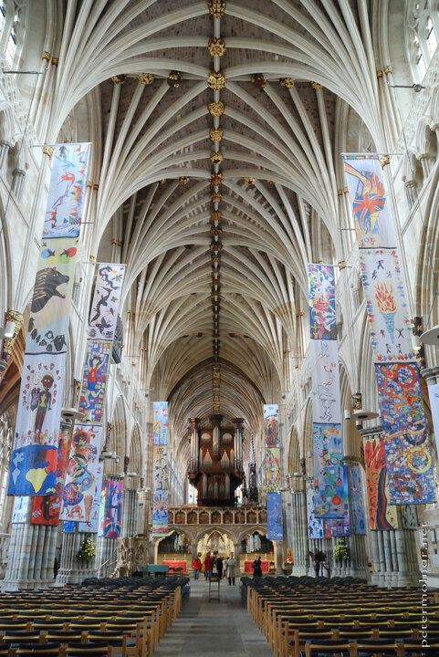

---
author:
    email: mail@petermolnar.net
    image: https://petermolnar.net/favicon.jpg
    name: Peter Molnar
    url: https://petermolnar.net
coordinates:
    latitude: 50.722546
    longitude: -3.529776
copies:
- https://www.flickr.com/photos/36003160@N08/18108709698
- http://web.archive.org/web/20190624125424/https://petermolnar.net/exeter-cathedral/
published: '2015-05-31T08:17:22+00:00'
syndicate:
- https://brid.gy/publish/flickr
tags:
- church
- Exeter
- ceiling
- medieval
- cathedral
- flag
- interior
- temple
title: Exeter Cathedral

---

Nothing special to tell here, except for the story of their leaflets.
When you enter a place they usually ask you what language you'd prefer
and usually I make the joke that of course Hungarian - for my biggest
surprise, they had Hungarian leaflets. Both unexpected and heartwarming
for a British cathedral. Thank you, Exeter!