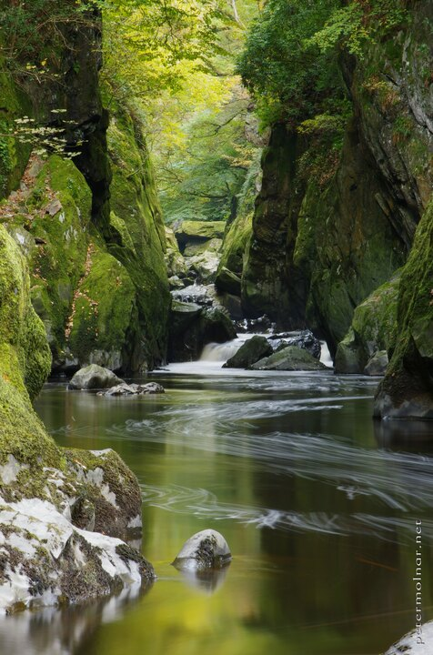

---
author:
    email: mail@petermolnar.net
    image: https://petermolnar.net/favicon.jpg
    name: Peter Molnar
    url: https://petermolnar.net
coordinates:
    latitude: 53.0734592299806
    longitude: -3.79318337991944
copies:
- https://www.flickr.com/photos/36003160@N08/35519001482
- http://web.archive.org/web/20190624125432/https://petermolnar.net/fairy-glen/
published: '2017-01-07T16:00:00+00:00'
syndicate:
- https://brid.gy/publish/flickr
tags:
- water
- river
- autumn
- forest
- waterfall
- Wales
- longexpo
title: Fairy Glen

---

The surroundings of Betws-y-Coed can offer numerous attractions, from
peaks to abandoned mines, but there is a certain little creek which
looks like a place out of myths and fairytales: the Fairy Glen. The
whole area is a light trip, but it makes a beautiful view. Unfortunately
it looks like the only way to get to the really nice areas are through
the water, which I would love to do once. It will certainly has to be
during summer though, and I'll need proper waterproof casing for my
gear, so it may be challenging.