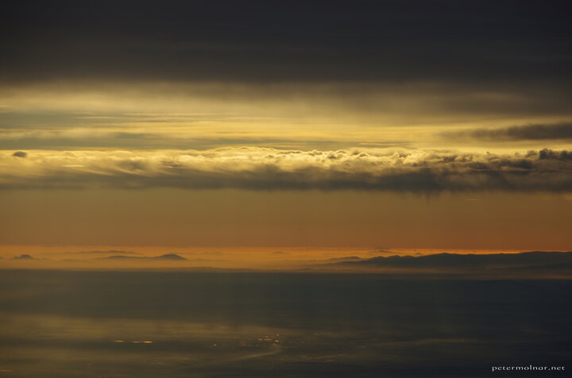

---
author:
    email: mail@petermolnar.net
    image: https://petermolnar.net/favicon.jpg
    name: Peter Molnar
    url: https://petermolnar.net
copies:
- https://www.flickr.com/photos/36003160@N08/15988787369
- http://web.archive.org/web/20150503043540/https://petermolnar.eu/photo/false-sunset/
published: '2015-01-02T14:53:00+00:00'
syndicate:
- https://brid.gy/publish/flickr
tags:
- aerial
- sunset
- air
title: False sunset

---

It's been a long time since I last photographed sunsets, but this was
something different. On the flight from the UK to Hungary we had this
scene, where it was hard to tell where the sun actually is. It was 14:50
local time, therefore the real sunset was hours ahead, yet the view was
stunningly apocalyptic.