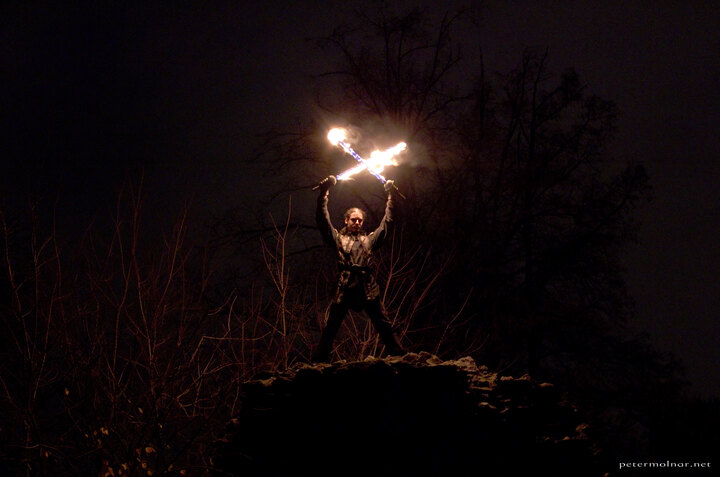

---
author:
    email: mail@petermolnar.net
    image: https://petermolnar.net/favicon.jpg
    name: Peter Molnar
    url: https://petermolnar.net
copies:
- https://www.flickr.com/photos/36003160@N08/23136990864
- http://web.archive.org/web/20160709134833/https://petermolnar.eu/fire-cavalier/
published: '2015-12-15T10:59:05+00:00'
syndicate:
- https://brid.gy/publish/flickr
tags:
- fire
- jugglers
- fantasy
- warriors
- burning sword
- warrior
- fire sword
- juggling
title: Fire Cavalier

---

Fire Cavalier by Kornél József.

Our friends from Mare Temporis asked my wife, Nora Hamucska, to take a
few promotional pictures for them for their pretty awesome show, "The
Prince and the Dragon" (A herceg és a sárkány).

I could not resist not to take a few photos myself.

Kornél was mad enough to climb on the top of a \~7m meters high ruin of
a wall - mad, because it was near pitch black -, so his backgrounds are
actual top of trees.