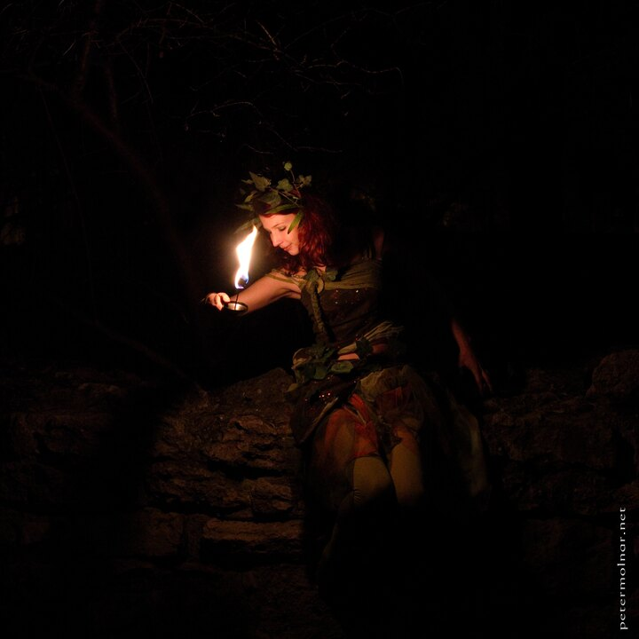

---
author:
    email: mail@petermolnar.net
    image: https://petermolnar.net/favicon.jpg
    name: Peter Molnar
    url: https://petermolnar.net
copies:
- https://www.flickr.com/photos/36003160@N08/23495106580/
- http://web.archive.org/web/20160709134836/https://petermolnar.eu/fire-fairy/
published: '2015-12-16T15:11:00+00:00'
syndicate:
- https://brid.gy/publish/flickr
tags:
- fire
- jugglers
- fantasy
- nymph
- candle light
- fairy
- candle
- juggling
- pixie
title: Fire Fairy

---

Fire Fairy by Szabina Fogarasi

Our friends from Mare Temporis asked my wife, Nora Hamucska, to take a
few promotional pictures for them for their pretty awesome show, "The
Prince and the Dragon" (A herceg és a sárkány).

I could not resist not to take a few photos myself.

I nearly never manipulate my images - in terms of Photoshop retouching,
not as levels and color fixing -, but I had to remove some lights from
the background; they were somewhat runining the experience.