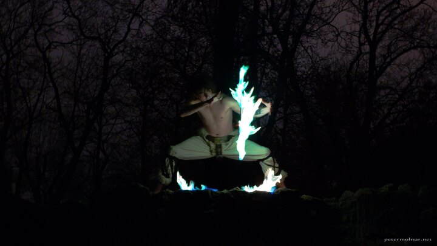

---
author:
    email: mail@petermolnar.net
    image: https://petermolnar.net/favicon.jpg
    name: Peter Molnar
    url: https://petermolnar.net
coordinates:
    latitude: 47.529111
    longitude: 19.051214
copies:
- https://www.flickr.com/photos/36003160@N08/23269385592
- http://web.archive.org/web/20160709134839/https://petermolnar.eu/fire-shaman/
published: '2015-11-28T20:13:17+00:00'
syndicate:
- https://brid.gy/publish/flickr
tags:
- shaman
- jugglers
- fantasy
- fire
- green fire
- warlock
- juggling
title: Fire Shaman

---

Fire Shaman - green fire -, performed by fire juggler István Kertész.
Our friends from Mare Temporis asked my wife, Nora Hamucska, to take a
few promotional pictures for them for their pretty awesome show, "The
Prince and the Dragon" (A herceg és a sárkány).

I could not resist not to take a few photos myself.

Thank you very much everyone :)