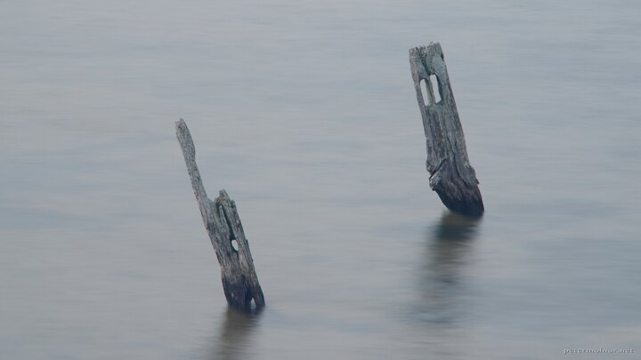

---
author:
    email: mail@petermolnar.net
    image: https://petermolnar.net/favicon.jpg
    name: Peter Molnar
    url: https://petermolnar.net
coordinates:
    latitude: 50.770337
    longitude: 0.153879
copies:
- https://www.flickr.com/photos/36003160@N08/17152968760
- http://web.archive.org/web/20190624125447/https://petermolnar.net/forlorn/
published: '2015-05-02T08:39:07+00:00'
syndicate:
- https://brid.gy/publish/flickr
tags:
- gloomy
- abandoned
- old
- ruin
- fogotten
- water
- lonely
title: Forlorn

---

This was the second time I tried to photography these forgotten piles in
the Seven Sisters Country Park; this time it was successful.

Sometimes you need a more stable tripod.