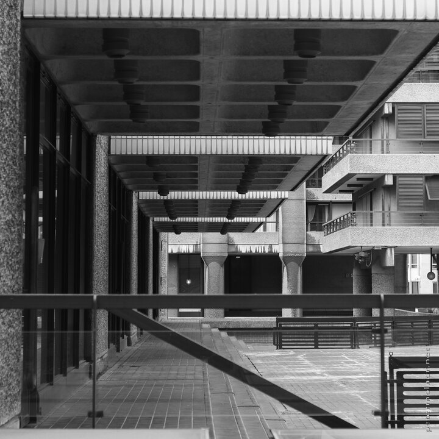

---
author:
    email: mail@petermolnar.net
    image: https://petermolnar.net/favicon.jpg
    name: Peter Molnar
    url: https://petermolnar.net
coordinates:
    latitude: 51.519812
    longitude: -0.0945309999166667
copies:
- https://www.flickr.com/photos/36003160@N08/18197493165
- http://web.archive.org/web/20190624125450/https://petermolnar.net/frozen-moment-from-the-70s/
published: '2015-05-28T14:12:27+00:00'
syndicate:
- https://brid.gy/publish/flickr
tags:
- urban
- black and white
- Barbican
- concrete
- 70s
- black & white
- London
- square
- architecture
title: Frozen moment of the 70s

---

Brustalism, as in architectural style was still present in England in
the early 70s - and Barbican is probably the largest piece of it.

It's like a frozen moment of the 70s - and not so surprisingly pretty
familiar for those who come from Hungary or any post-socialist European
country.