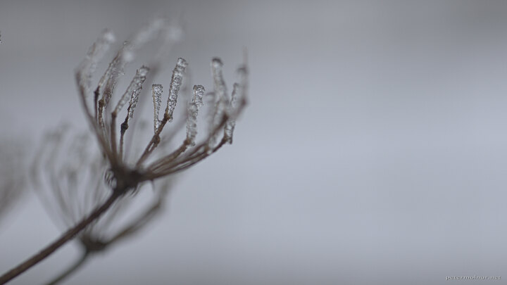

---
author:
    email: mail@petermolnar.net
    image: https://petermolnar.net/favicon.jpg
    name: Peter Molnar
    url: https://petermolnar.net
coordinates:
    latitude: 53.191378
    longitude: -2.029895
copies:
- https://www.flickr.com/photos/36003160@N08/17037021469
- http://web.archive.org/web/20150525183430/https://petermolnar.eu/photo/frozen/
published: '2015-04-21T12:52:32+00:00'
syndicate:
- https://brid.gy/publish/flickr
tags:
- ice
- frozen
- Peak District
- winter
title: Frozen

---

The Midlands do get some snow and proper winter, but not much. Yet
somehow we ended up in the only foggy spot on probably the whole Britain
on a Sunday when everywhere else the sun was shining. The trip was worth
it regardless of this.