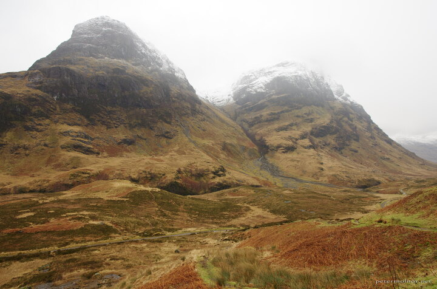

---
author:
    email: mail@petermolnar.net
    image: https://petermolnar.net/favicon.jpg
    name: Peter Molnar
    url: https://petermolnar.net
copies:
- https://www.flickr.com/photos/36003160@N08/38193564601
- http://web.archive.org/web/20190624125454/https://petermolnar.net/glencoe-scotland/
published: '2017-10-31T18:00:00+00:00'
syndicate:
- https://brid.gy/publish/flickr
tags:
- Scotland
- Glencoe
- mountains
- winter
- scottish
- landscape
title: Glencoe, Scotland

---

Clencoe in Scotland is a manificent place, but it feels incredibly
distant from what I'm usually used to. Vast, flowing clouds, close
enough that sometimes they are just above your head, snow capped, steep
(although not too large) mountains all around.