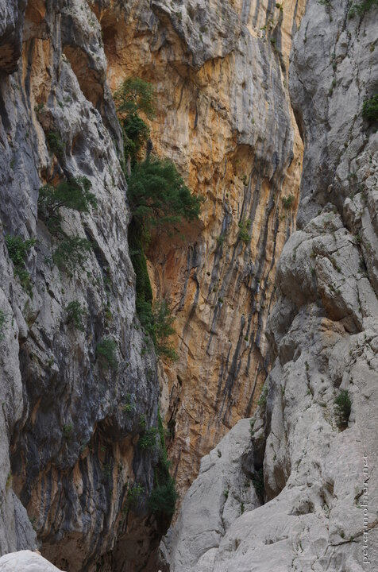

---
author:
    email: mail@petermolnar.net
    image: https://petermolnar.net/favicon.jpg
    name: Peter Molnar
    url: https://petermolnar.net
copies:
- http://web.archive.org/web/20190624125459/https://petermolnar.net/gola-di-gorropu/
- https://flickr.com/photos/petermolnareu/31709987617
published: '2019-01-07T18:00:00+00:00'
syndicate:
- https://brid.gy/publish/flickr
title: Gorropu Gorge

---

Gorropu Gorge is gigantic, peaceful, quiet, and quite steep to get to
when walking. There are signs up at the top of the hill before starting
to descent that it's no a light walk, and I have to admit, it's a decent
climb down and then up, but it's worth it.

Due to the size of the gorge, it's hard to show and represent it in
photos, so I decided for trying to capture the colours that surround you
when touring through it.
