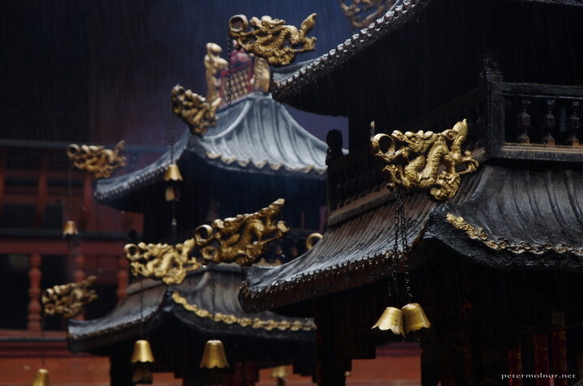

---
author:
    email: mail@petermolnar.net
    image: https://petermolnar.net/favicon.jpg
    name: Peter Molnar
    url: https://petermolnar.net
coordinates:
    latitude: 30.89705
    longitude: 103.566752
copies:
- https://www.flickr.com/photos/36003160@N08/26485761793
- http://web.archive.org/web/20190624125500/https://petermolnar.net/golden-dragons/
published: '2016-05-18T10:00:34+00:00'
syndicate:
- https://brid.gy/publish/flickr
tags:
- People's Republic of China
- Sichuan
- temple
- taoist
- religion
- mysterious
- China
- Mount Qingcheng
- taoism
title: Golden Dragons

---

What do you do when you're finally in China, but there's a massive rain
over the whole territory that's within range?

You go visit a mountain that is full of temples. Temples have roof, and
that is good, and they also have and incredible atmosphere in a weather
like this.