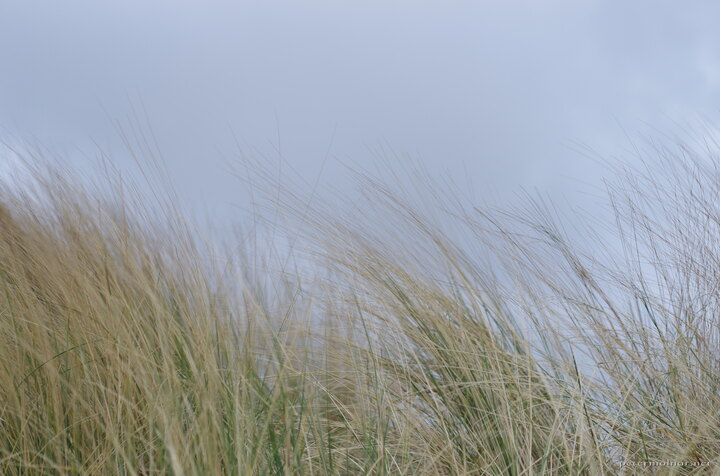

---
author:
    email: mail@petermolnar.net
    image: https://petermolnar.net/favicon.jpg
    name: Peter Molnar
    url: https://petermolnar.net
coordinates:
    latitude: 52.74558
    longitude: 1.669856
copies:
- https://www.flickr.com/photos/36003160@N08/16699757703
- http://web.archive.org/web/20150529113213/https://petermolnar.eu/photo/grass/
published: '2015-04-30T09:20:38+00:00'
syndicate:
- https://brid.gy/publish/flickr
tags:
- grass
- Horsey
- Norfolk
- shore
- United Kingdom
- multi-exposure
title: Grass

---

I was trying to catch the soft and calming feeling of the Norfolk shores
in Britain, so I ended up doing this multi-exposure image of the grass
on the beach sand dunes being waved by the wind.