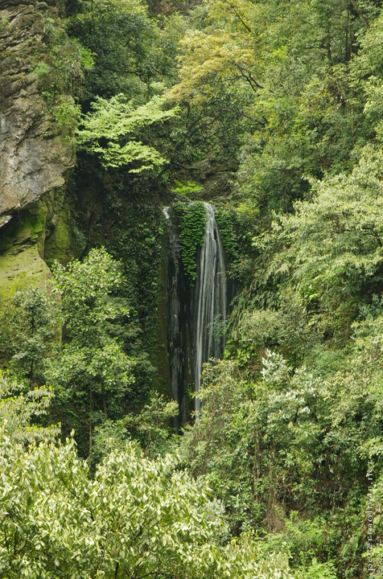

---
author:
    email: mail@petermolnar.net
    image: https://petermolnar.net/favicon.jpg
    name: Peter Molnar
    url: https://petermolnar.net
coordinates:
    latitude: 29.560131
    longitude: 103.388575
copies:
- https://www.flickr.com/photos/36003160@N08/27880756126
- http://web.archive.org/web/20190624125507/https://petermolnar.net/greens-of-emei-1/
published: '2016-06-26T10:00:20+00:00'
syndicate:
- https://brid.gy/publish/flickr
tags:
- People's Republic of China
- Sichuan
- green
- outdoor
- forest
- Mount Emei
- Asia
- Emeishan
- waterfall
- China
title: Greens of Emei 1

---

Emei Mountain has countless waterfalls - and besides their numbers, they
are huge. During spring, the whole mountain turns green, all variations
and combinations of green; the air is heavy, but clean, and the noises
of the forest are distant and unfamiliar for someone from Europe.