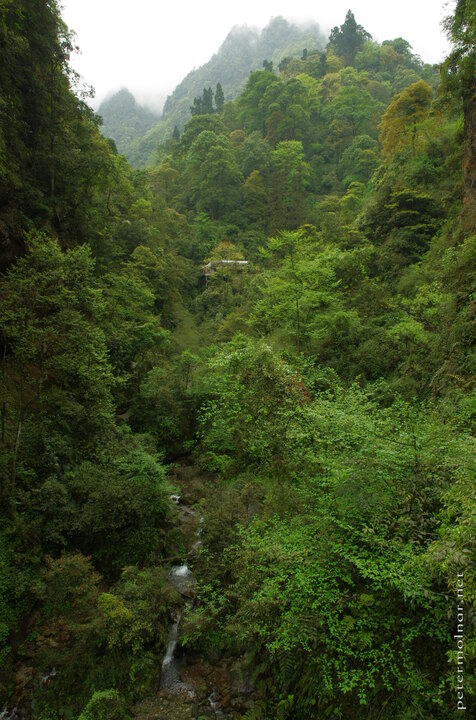

---
author:
    email: mail@petermolnar.net
    image: https://petermolnar.net/favicon.jpg
    name: Peter Molnar
    url: https://petermolnar.net
coordinates:
    latitude: 29.557872
    longitude: 103.386825
copies:
- https://www.flickr.com/photos/36003160@N08/27832877192
- http://web.archive.org/web/20160709134906/https://petermolnar.eu/greens-of-emei-2/
published: '2016-06-27T10:00:21+00:00'
syndicate:
- https://brid.gy/publish/flickr
tags:
- People's Republic of China
- Sichuan
- green
- forest
- Mount Emei
- mist
- misty
- mountain
- Emeishan
- trees
- waterfall
- China
title: Greens of Emei 2

---

Emei Mountain: the home of the first ever Buddhist monastery in China -
according to the legends. Countless stairs with barely anyone on the
routes where monasteries are still alive and breathing.