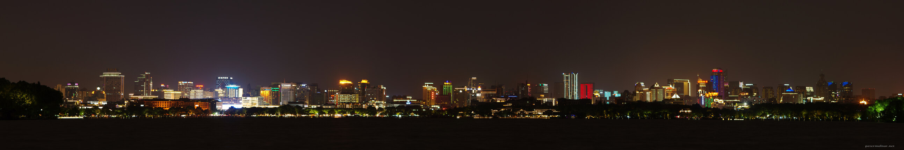

---
author:
    email: mail@petermolnar.net
    image: https://petermolnar.net/favicon.jpg
    name: Peter Molnar
    url: https://petermolnar.net
copies:
- http://web.archive.org/web/20190814180505/https://petermolnar.net/hangzhou-west-lake-night/
- https://www.flickr.com/photos/petermolnareu/48527276102/
published: '2019-08-13T09:00:00+01:00'
syndicate:
- https://brid.gy/publish/flickr
tags:
- China
- People's Republic of China
- West Lake
- Hangzhou
title: Hangzhou West Lake at night

---

The West Lake in Hangzhou is probably one of the most visited tourist
spots in the whole of China. Apparently it's true beauty only appears
when there's mist and fog around - having had a clear night when we were
there, it seems fairly true. Without the mystical cover, it's a merely
large, although very nice lake with a bright, and modern view.