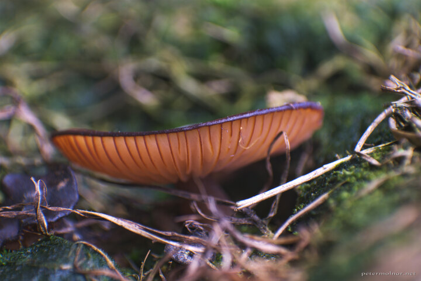

---
author:
    email: mail@petermolnar.net
    image: https://petermolnar.net/favicon.jpg
    name: Peter Molnar
    url: https://petermolnar.net
coordinates:
    latitude: 51.47726
    longitude: -0.230165
copies:
- https://www.flickr.com/photos/36003160@N08/14959038471
- http://web.archive.org/web/20140922190541/https://petermolnar.eu/photo/hidden-world-orange-mushroom/
published: '2014-08-18T20:00:48+00:00'
syndicate:
- https://brid.gy/publish/flickr
tags:
- moss
- orange
- macro
- mushroom
title: Hidden world - orange mushroom

---

At the London Wetland Centre there is a small area that resembles
Iceland, with a wall made of stones and lots of moss. I've found this
little, orange mushroom there.