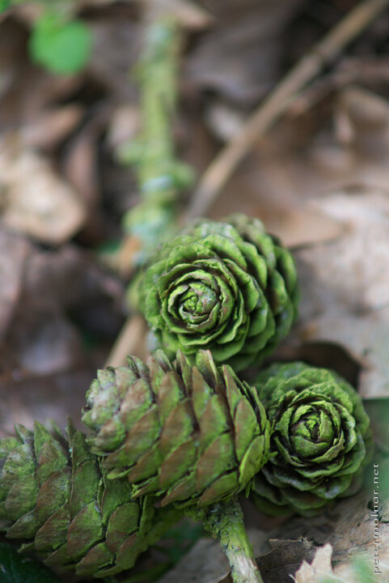

---
author:
    email: mail@petermolnar.net
    image: https://petermolnar.net/favicon.jpg
    name: Peter Molnar
    url: https://petermolnar.net
coordinates:
    latitude: 52.832652
    longitude: 0.508782
copies:
- https://www.flickr.com/photos/36003160@N08/14786370477
- http://web.archive.org/web/20140919095427/https://petermolnar.eu/photo/hidden-world-pine-cones-in-norfolk-forest/
published: '2014-08-19T20:00:47+00:00'
syndicate:
- https://brid.gy/publish/flickr
tags:
- Norfolk
- hidden
- cone
- lichen
- pine
- macro
title: Hidden world - pine cones in Norfolk forest

---

Lichen is common in a fir forest, but I rarely encounter this much
covered cones.