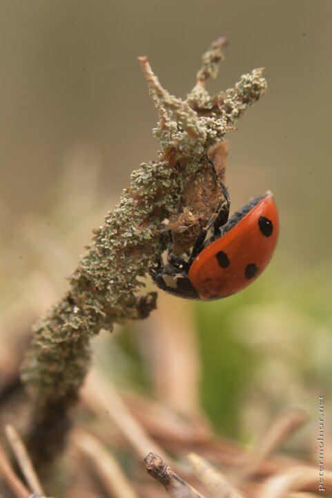

---
author:
    email: mail@petermolnar.net
    image: https://petermolnar.net/favicon.jpg
    name: Peter Molnar
    url: https://petermolnar.net
coordinates:
    latitude: 59.796575
    longitude: 17.698802
copies:
- https://www.flickr.com/photos/36003160@N08/14992286202
- http://web.archive.org/web/20140919215819/https://petermolnar.eu/photo/hidden-world-resting-ladybird/
published: '2014-08-21T20:00:28+00:00'
syndicate:
- https://brid.gy/publish/flickr
tags:
- ladybug
- lichen
- macro
- ladybird
- pine
title: Hidden world - resting ladybird

---

We arrived in Norra Lunsen, a natural reserve in Sweden - according to
the local tourist information, it's the middle of nowhere yet it's
literally on the edge of the city. After sitting down it only took a few
minutes to notice all the small, living things around; like this little
ladybird resting on a lichen covered branch.