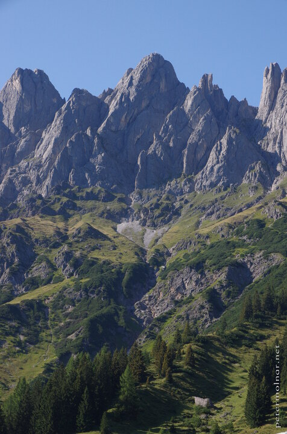

---
author:
    email: mail@petermolnar.net
    image: https://petermolnar.net/favicon.jpg
    name: Peter Molnar
    url: https://petermolnar.net
coordinates:
    latitude: 47.4100910000917
    longitude: 13.1297310001139
copies:
- https://www.flickr.com/photos/36003160@N08/21487084238
- http://web.archive.org/web/20190624125529/https://petermolnar.net/high-alps/
published: '2015-09-24T10:26:03+00:00'
syndicate:
- https://brid.gy/publish/flickr
tags:
- bright
- sunshine
- blue
- green
- summer
- Murmeltierweg
- mountain
- mountains
- Austria
- sky
- altitude
- Alps
title: High Alps

---

This is the place where marmots live.

They have a impressive taste.