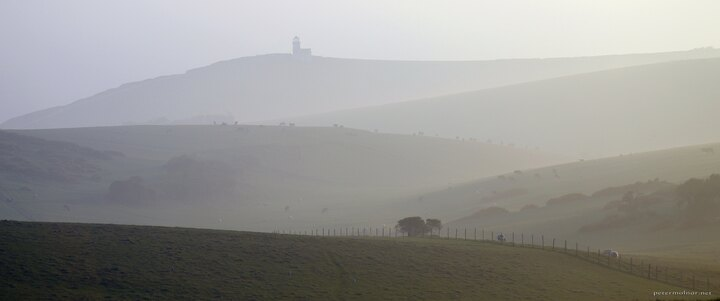

---
author:
    email: mail@petermolnar.net
    image: https://petermolnar.net/favicon.jpg
    name: Peter Molnar
    url: https://petermolnar.net
coordinates:
    latitude: 50.74555
    longitude: 0.237146
copies:
- https://www.flickr.com/photos/36003160@N08/16669044043
- http://web.archive.org/web/20150528071500/https://petermolnar.eu/photo/hills-from-beachy-head/
published: '2015-04-27T13:43:16+00:00'
syndicate:
- https://brid.gy/publish/flickr
tags:
- England
- hills
- lighthouse
- English
- sunset
- shore
- Beachy Head
- Eastbourne
- countryside
title: Hills from Beachy Head

---

When we first visited Beachy Head we could not stay to enjoy - and
photograph - the sunset from that marvellous and exceptional location;
this time, we arrived right on time. This area is a gorgeous example of
The Stereotype Countryside but it's still astonishing and lovely :)