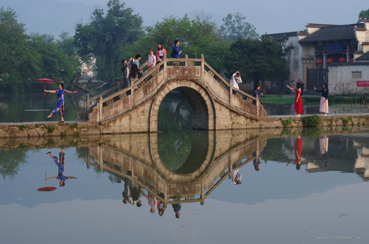

---
author:
    email: mail@petermolnar.net
    image: https://petermolnar.net/favicon.jpg
    name: Peter Molnar
    url: https://petermolnar.net
copies:
- https://www.flickr.com/photos/petermolnareu/48956181043/
- http://web.archive.org/web/20191026082222/https://petermolnar.net/hongcun-bridge-1/
published: '2019-10-25T09:00:00+01:00'
syndicate:
- https://brid.gy/publish/flickr
tags:
- China
- People's Republic of China
- bridge
- reflection
- Hongcun
- morning
title: Hongcun bridge

---

I firmly believe that it is now impossible to take a picture of the
bridge in Hongcun without people already occupying it to take a selfie.
Or a lot of selfie. And one more selfie.

This was taken 07:05 local time, about an hour after sunrise and before
the tourists were allowed in, meaning these people all slept inside
Hongcun as well.