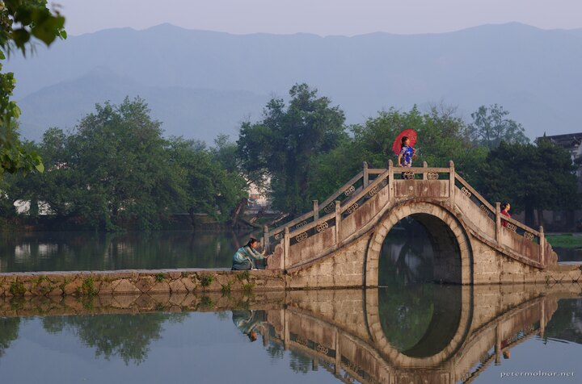

---
author:
    email: mail@petermolnar.net
    image: https://petermolnar.net/favicon.jpg
    name: Peter Molnar
    url: https://petermolnar.net
copies:
- https://www.flickr.com/photos/petermolnareu/48961685632/
- http://web.archive.org/web/20191027182859/https://petermolnar.net/hongcun-bridge-2/index.html
published: '2019-10-26T09:00:00+01:00'
syndicate:
- https://brid.gy/publish/flickr
tags:
- China
- People's Republic of China
- bridge
- morning
- reflection
- Hongcun
title: Hongcun bridge closeup

---

As mentioned before, I don't think there's a chance to take an image if
the bridge only. However, if you're early and patient enough, an
opportunity might present itself when only people who actually fit the
settings are on the path.

I know the framing is a bit off, but there were people standing on both
edge of the bridge, and it was either to cut the reflection, or to break
the scene.