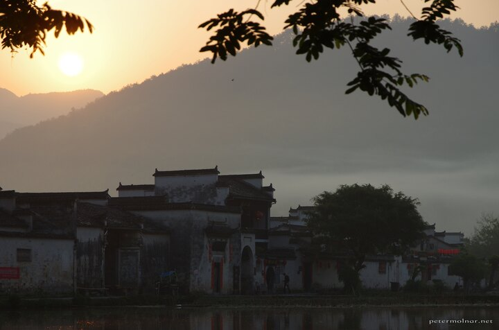

---
author:
    email: mail@petermolnar.net
    image: https://petermolnar.net/favicon.jpg
    name: Peter Molnar
    url: https://petermolnar.net
copies:
- http://web.archive.org/web/20191025081804/https://petermolnar.net/hongcun-lake-sunrise/
- https://www.flickr.com/photos/petermolnareu/48951645951/
published: '2019-10-24T09:00:00+01:00'
syndicate:
- https://brid.gy/publish/flickr
tags:
- China
- People's Republic of China
- Hongcun
- sunrise
- mountains
- village
title: Sunrine in Hongcun

---

Just the sun rising above Hongcun with misty mountains in the
background. Nothing special apart from the idyllic and near perfect
conditions to feel how China probably was a few hundred years ago.