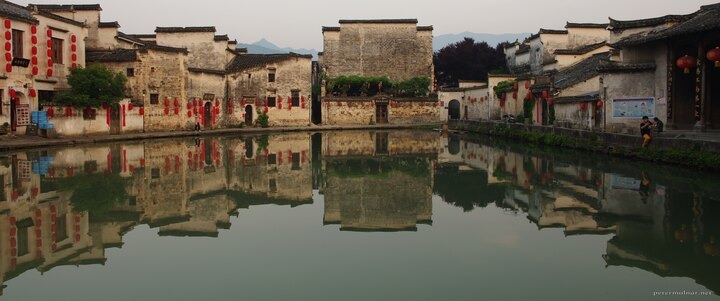

---
author:
    email: mail@petermolnar.net
    image: https://petermolnar.net/favicon.jpg
    name: Peter Molnar
    url: https://petermolnar.net
copies:
- https://www.flickr.com/photos/petermolnareu/48945854608/
- http://web.archive.org/web/20191024092705/https://petermolnar.net/hongcun-moon-lake-sunrise/
published: '2019-10-23T09:00:00+01:00'
syndicate:
- https://brid.gy/publish/flickr
tags:
- China
- People's Republic of China
- Hongcun
- Anhui
title: Sunrise at the Moon Lake in Hongcun

---

The Moon Lake is in the middle of Hongcun and is the "belly" of the
water system running across the town like veins. It has fisn, snails,
shellfish, and a lot of special plants that filter and clean the water.

We tried to get out here early as possible, but we still weren't the
first, even though the sun has just rose up when this picture was taken.