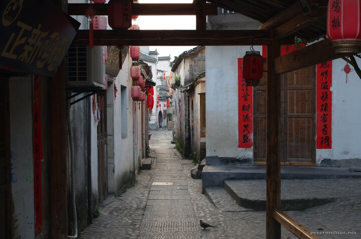

---
author:
    email: mail@petermolnar.net
    image: https://petermolnar.net/favicon.jpg
    name: Peter Molnar
    url: https://petermolnar.net
copies:
- http://web.archive.org/web/20191020081425/https://petermolnar.net/hongcun-streets/
- https://www.flickr.com/photos/petermolnareu/48941679371/
published: '2019-10-22T09:00:00+01:00'
syndicate:
- https://brid.gy/publish/flickr
tags:
- China
- People's Republic of China
- Hongcun
- village
- morning
title: Empty morning in Hongcun

---

Want empty streets in Hongcun? Sleep inside the town, because it's loked
from visitors till 7am. And get up around 5am. If you do so, you'll meet
adorable cats loudly welcoming you and a crispy morning, with unique
street views.