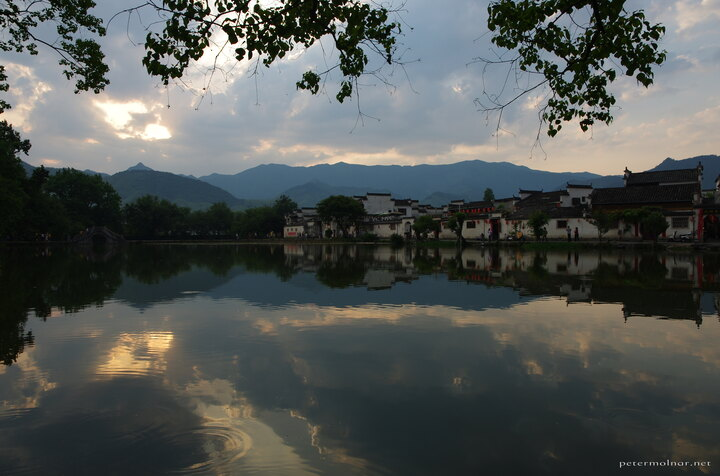

---
author:
    email: mail@petermolnar.net
    image: https://petermolnar.net/favicon.jpg
    name: Peter Molnar
    url: https://petermolnar.net
copies:
- http://web.archive.org/web/20191021074306/https://petermolnar.net/hongcun-village-sunset/
- https://www.flickr.com/photos/petermolnareu/48935393243/
published: '2019-10-19T22:30:00+01:00'
syndicate:
- https://brid.gy/publish/flickr
tags:
- China
- People's Republic of China
- Hongcun
- Anhui
- sunset
- lake
title: Sunset in Hongcun

---

Hongcun ( 宏村 ) is a small, old village in Anhui province - and it's
location of the opening scenes of Crouching Tiger, Hidden Dragon. This
fact made Hongcun one of the most frequently visited tourist attractions
in China. I saw images from before the movie, from the '90s, and there
were absolutely no sign of the level of decoration anywhere, let alone
the hurds of humans cross the bridge the same direction Li Mu Bai did.

Hongcun has a very unique water - and plumbing system. The South Lake in
this photo it's essentially the storage tank of city-wide hydrophonics
with biological cleaning.