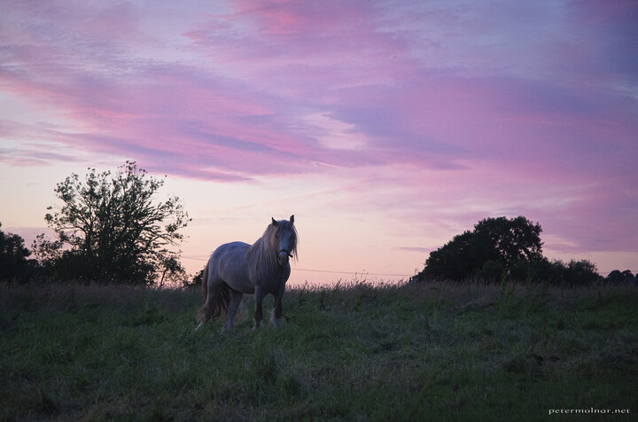

---
author:
    email: mail@petermolnar.net
    image: https://petermolnar.net/favicon.jpg
    name: Peter Molnar
    url: https://petermolnar.net
coordinates:
    latitude: 53.141248
    longitude: -1.534094
copies:
- https://www.flickr.com/photos/36003160@N08/22042024546
- http://web.archive.org/web/20190624125543/https://petermolnar.net/horse/
published: '2015-10-10T09:41:48+00:00'
syndicate:
- https://brid.gy/publish/flickr
tags:
- purple
- outdoor
- horse
- sunset
title: Horsee

---

We were driving back from a long day in Matlock - apparently we're crazy
enough to do day-trips involving \~6 hours of driving and including a
bit of walk as well - when we spotted a litte road, with two horses,
right in front of a magnificent sunset.

The further horse was incredibly friendly, especially when it got a few
bits from some grapes we couldn't finish.